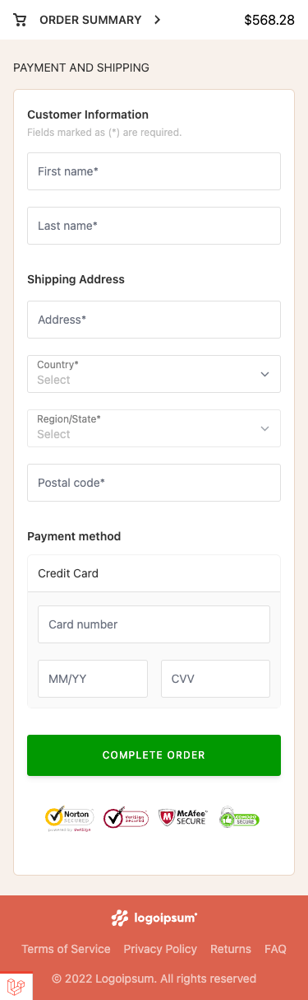

## Task

Create checkout ant implement API payment provider.

## Technologies:
- ReactJS
- Laravel
- Message broker / Laravel events
- Redis

## TODO
1. Implement payment provider
   2. Stripe
   3. PayPal
   4. Paddle
   5. ...
2. Add payment provider events and jobs
3. Implement add to cart functionality
4. Implement loading and error states at frontend
5. ...

## Architecture

<p align="center"></p>

<p align="center"></p>

## Installation

1. Clone the repository:
```bash
git clone https://github.com/Karolis97/ecommerce-checkout.git
```

2. Clone the repository:
```bash
cd ecommerce-checkout
```

3. Install composer dependencies
```bash
composer install
```

4. Copy the .env.example file to .env and configure your application and database settings:
```bash
cp .env.example .env
```

5. Start the Docker environment with Laravel Sail (this command will install all necessary Docker containers):
```bash
./vendor/bin/sail up -d
```

6. Install NPM packages and run Vite.js for asset compilation:
```bash
./vendor/bin/sail npm install
./vendor/bin/sail npm run build
```

7. Generate an application key:
```bash
./vendor/bin/sail artisan key:generate
```

8. Run the database migrations and seeders to set up your database with initial data:
```bash
./vendor/bin/sail artisan migrate:fresh --seed
```

9. Run application tests:
```bash
./vendor/bin/sail artisan test
```

## Application

<p align="center"></p>

<p align="center"></p>

<p align="center"></p>

<br>

```
Tests:    22 passed (108 assertions)
Duration: 2.15s
Parallel: 11 processes
```

## Testing orders

**Credit card information:**
* Number: 5105 1051 0510 5100 
* Expiry date: 01/25 
* CVV: 111
